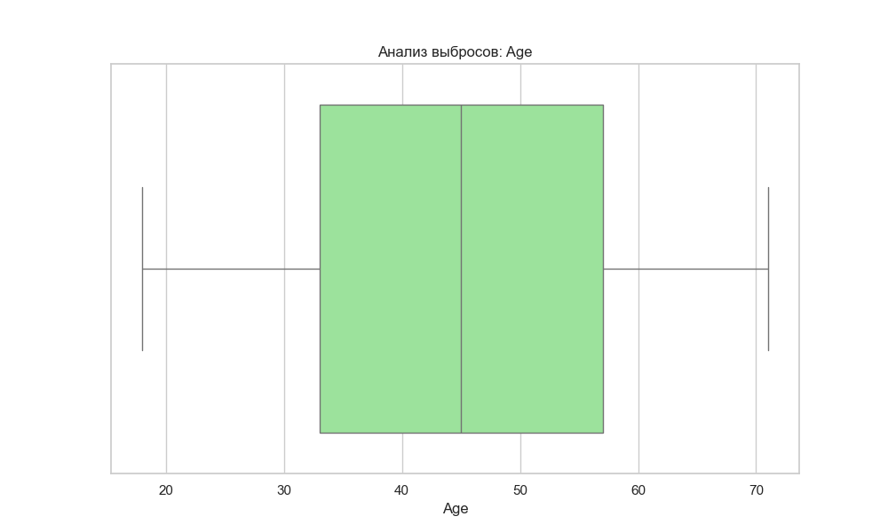
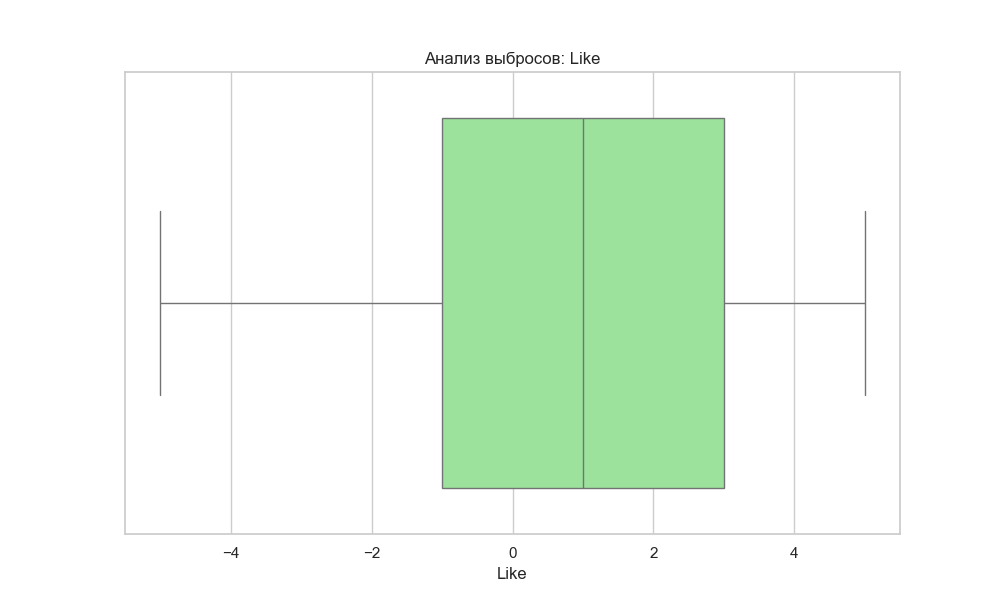
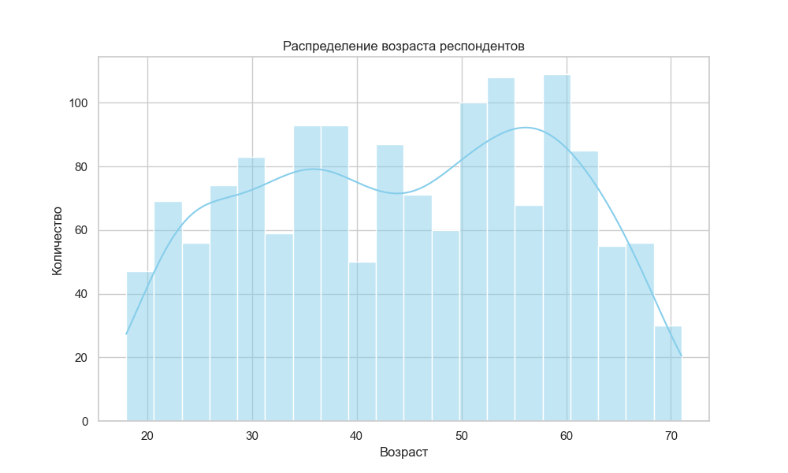
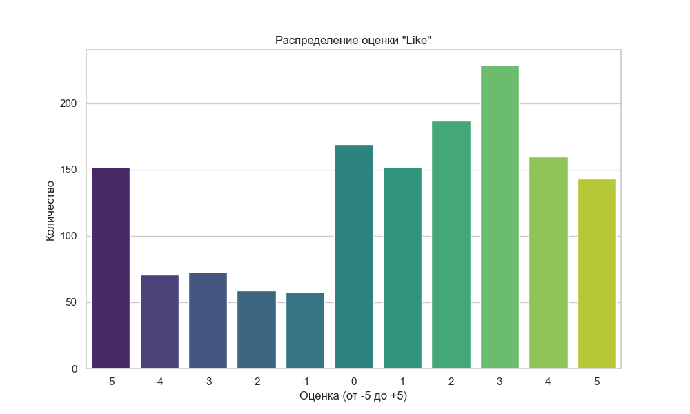
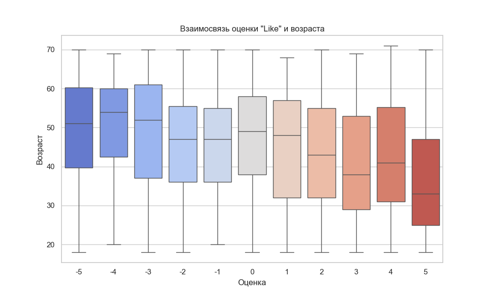
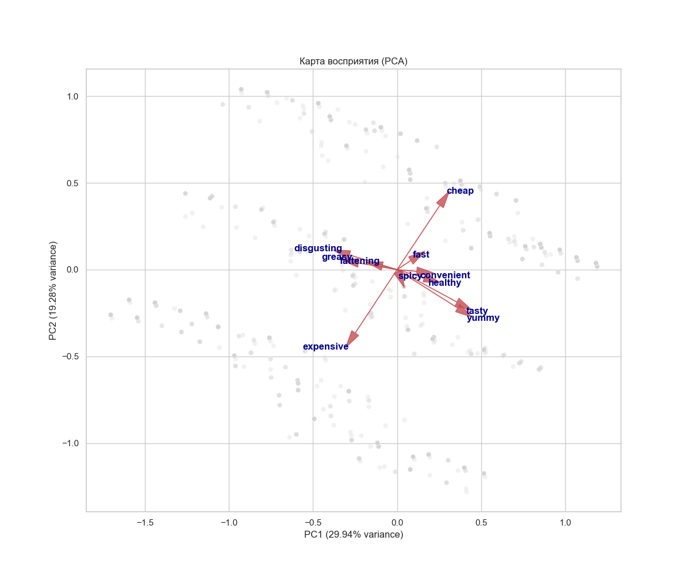
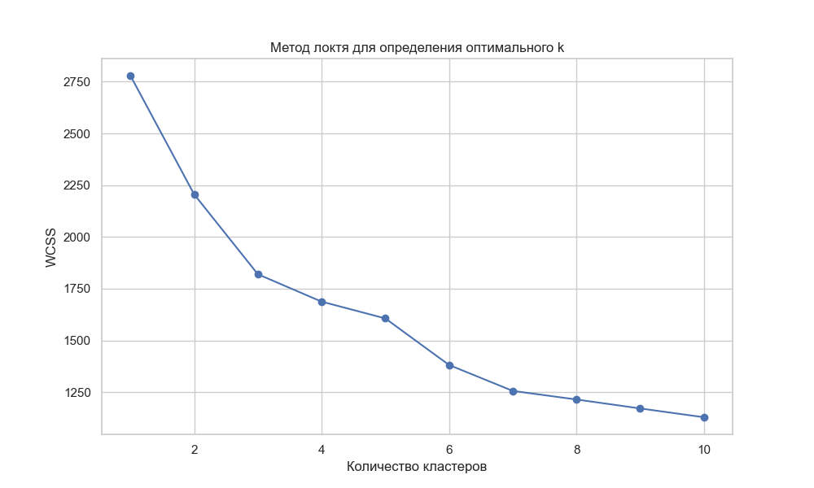
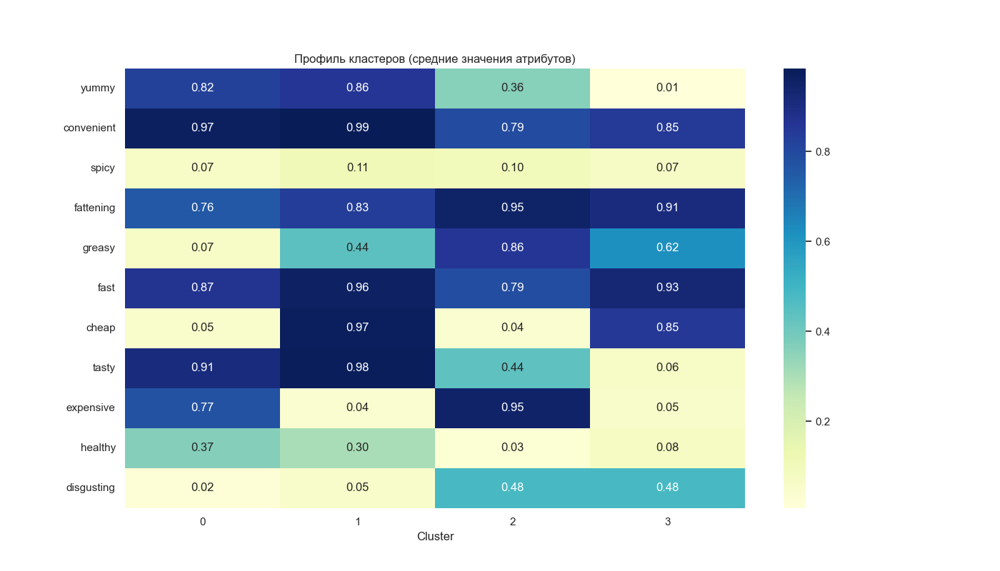

Министерство образования Республики Беларусь

Учреждение образования

БЕЛОРУССКИЙ ГОСУДАРСТВЕННЫЙ УНИВЕРСИТЕТ

ИНФОРМАТИКИ И РАДИОЭЛЕКТРОНИКИ

Факультет компьютерных систем и сетей

Кафедра программного обеспечения информационных технологий

Дисциплина: Статистические методы анализа данных

**Аналитическая записка**

к итоговой аналитической работе

`                  `Выполнил 

`                  `студент гр. [Ваша группа]                                                    [Ваше ФИО]

`        `Проверил:                                                                  [ФИО Преподавателя] 

`                                               `Минск   2025

**Вариант [Ваш Вариант]** 

Целевая переменная для анализа **- Удовлетворенность** (Like).

1. # **ОЧИСТКА И ПОДГОТОВКА ДАННЫХ**
   1. ## **Обработка Пропущенных Значений и Дубликатов**
Пропуски: В ходе первичного анализа пропущенных значений в наборе данных обнаружено не было. Все столбцы (yummy, convenient, spicy, fattening, greasy, fast, cheap, tasty, expensive, healthy, disgusting, Like, Age, VisitFrequency, Gender) заполнены полностью.

Дубликаты: В наборе данных было обнаружено 22 полных дубликата строк. Учитывая природу данных (опрос), это могут быть реальные совпадения ответов разных респондентов, однако для чистоты статистического анализа они могут быть исключены или оставлены в зависимости от задачи. В данном отчете анализ проводится на полном наборе.

Размер данных: Исходный размер набора составил 1453 строки и 15 столбцов.

1. ## ` `**Обработка Выбросов**
Анализ: проведен анализ выбросов в количественных признаках Age (Возраст) и Like (Удовлетворенность) с использованием метода межквартильного размаха (IQR). Для бинарных признаков (пол, атрибуты восприятия) и категориальной частоты посещений анализ выбросов не проводился.

**Age (Возраст):**
Границы IQR составили [-3.00, 93.00]. Выбросов не обнаружено (0 выбросов).
- 

**Like (Удовлетворенность):**
Границы IQR составили [-7.00, 9.00]. Выбросов не обнаружено (0 выбросов).
- 

Для визуального анализа выбросов были построены **Boxplot (Ящик с усами)**. Эти графики позволяют наглядно увидеть медиану, квартили и потенциальные выбросы (точки за пределами "усов"). В данном случае графики подтверждают отсутствие аномальных значений в признаках Age и Like.

1. # **ВИЗУАЛИЗАЦИЯ И ПЕРВИЧНЫЙ АНАЛИЗ ДАННЫХ**
   1. ## **Одномерный Анализ (Распределения)**
- **Age (Возраст)**: Распределение возраста респондентов близко к равномерному с небольшими пиками в группах 50-60 лет. Это говорит о том, что опрос охватывает широкую возрастную аудиторию.
- **Like (Удовлетворенность)**: Распределение оценки "Like" (преобразованной в шкалу от -5 до +5) показывает бимодальную структуру. Наблюдаются пики как в положительной зоне (около +3, +4), так и в отрицательной (около -3, -4). Это свидетельствует о поляризации мнений клиентов: люди либо любят McDonald's, либо нет, нейтральных оценок меньше.

Для визуализации распределения возраста была выбрана **Гистограмма**, так как она является оптимальным инструментом для оценки плотности распределения непрерывной величины. Для дискретной оценки "Like" использована **Столбчатая диаграмма**, позволяющая четко сравнить частоту каждой категории ответов.

  1. ## ` `**Двумерный Анализ (Взаимосвязи)**
**Like vs. Age**: Диаграмма размаха (Boxplot) показывает взаимосвязь между возрастом и оценкой. Визуально медианный возраст в группах с разными оценками варьируется незначительно, однако можно заметить, что более молодые респонденты склонны давать более полярные оценки. Явной линейной зависимости между возрастом и удовлетворенностью не наблюдается.

Для анализа взаимосвязи между количественной (Age) и категориальной/порядковой (Like) переменными была выбрана **Диаграмма размаха ("Ящик с усами")**. Этот тип визуализации обоснован тем, что он позволяет компактно отобразить медиану, квартили и выбросы распределения возраста для каждой оценки удовлетворенности, облегчая сравнение групп между собой.

1. # **ПОИСК СКРЫТЫХ ЗАВИСИМОСТЕЙ**
   **Предлагаемый подход**: В связи с тем, что набор данных представляет собой результаты опроса с большим количеством бинарных переменных восприятия, прямой корреляционный анализ может быть недостаточно информативен. Для поиска скрытых зависимостей и структур в данных предлагается следующий подход:
   1. **Снижение размерности (PCA)**: Для выявления латентных (скрытых) факторов, объединяющих множество наблюдаемых атрибутов.
   2. **Кластеризация (K-means)**: Для выявления скрытых групп респондентов с похожими профилями ответов.

   1. ## **Анализ Главных Компонент (PCA)**
Для выявления скрытых факторов восприятия бренда был проведен анализ главных компонент (PCA) на основе 11 атрибутов восприятия (yummy, convenient, spicy и др.).

- **Карта восприятия**: Визуализация первых двух главных компонент позволяет увидеть, как группируются атрибуты.
    - Векторы "fattening", "disgusting", "greasy" направлены в одну сторону, формируя фактор "Негативное восприятие / Вредность".
    - Векторы "tasty", "yummy" направлены в противоположную сторону, формируя фактор "Вкус / Удовольствие".
    - Атрибуты "cheap", "convenient" формируют отдельное направление "Удобство / Цена".
Это позволяет сделать вывод, что основное различие в восприятии клиентов лежит в плоскости "Вкусно, но вредно" против "Невкусно и вредно".

Для отображения результатов PCA была выбрана **Диаграмма рассеяния (Scatter Plot) с векторами нагрузок (Biplot)**. Данная визуализация обоснована необходимостью показать взаимное расположение переменных в новом пространстве признаков: близость векторов на плоскости указывает на их корреляцию и принадлежность к одному скрытому фактору.

  1. ## **Кластерный Анализ**
Для сегментации аудитории был применен метод K-means.

- **Метод локтя**: График WCSS показывает изгиб в районе k=4, что было выбрано как оптимальное количество кластеров. Для обоснования выбора числа кластеров использован **Линейный график**, который наглядно демонстрирует динамику уменьшения внутрикластерной суммы квадратов при увеличении числа кластеров, позволяя визуально определить точку перегиба ("локоть").

- **Профилирование кластеров**:
    - **Кластер 0 ("Премиум / Качество")**: Самый малочисленный (197 чел.). Высоко оценивают "yummy" (82%) и "tasty" (91%), но считают еду "expensive" (77%). Для них McDonald's — это вкусно, но дорого. Средний возраст: 44 года.
    - **Кластер 1 ("Лояльные / Экономные")**: Самый крупный сегмент (601 чел.). Очень высокие оценки "cheap" (97%), "convenient" (98%), "fast" (96%) и "tasty" (97%). Считают еду вкусной, быстрой и дешевой. Идеальные клиенты. Средний возраст: 43 года.
    - **Кластер 2 ("Скептики / Дорого и вредно")**: Считают еду "fattening" (95%), "greasy" (85%) и "expensive" (95%). Низкие оценки вкуса ("yummy" 36%). Воспринимают бренд негативно: дорого и вредно. Средний возраст: 44 года.
    - **Кластер 3 ("Хейтеры / Дешево и вредно")**: Считают еду "cheap" (85%) и "fast" (92%), но абсолютно невкусной ("yummy" < 1%, "tasty" 6%). Высокий уровень "disgusting" (48%). Для них это "дешевая забегаловка". Это самая возрастная группа (средний возраст 49 лет).

Для интерпретации полученных сегментов была использована **Тепловая карта (Heatmap)**. Выбор данной визуализации обоснован тем, что она позволяет одновременно отобразить средние значения множества атрибутов для нескольких кластеров, используя цветовую кодировку для быстрого выявления характерных черт (профиля) каждого сегмента.

**Заключение**:
Анализ показал, что аудитория McDonald's сильно поляризована. Ключевыми драйверами положительной оценки являются вкус (tasty, yummy), в то время как негатив связан с восприятием еды как жирной и вредной (greasy, fattening). Хотя прямой линейной связи между возрастом и удовлетворенностью не выявлено, кластерный анализ показал, что группа наиболее негативно настроенных клиентов ("Хейтеры") имеет более высокий средний возраст (49 лет) по сравнению с лояльной аудиторией (43 года).
